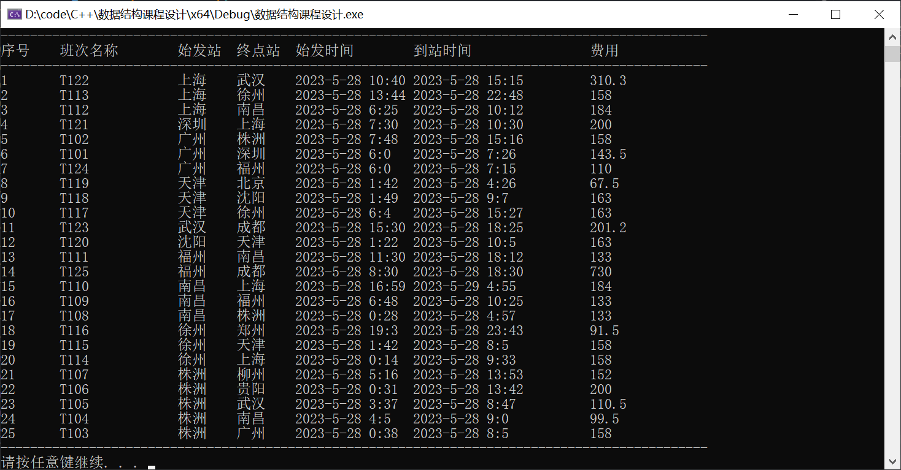

# National Traffic Consulting Simulation System

Course design for data structure: National Traffic Consulting Simulation System. 

Single source shortest path search based on Dijkstra algorithm. A kind of adjacency list is designed for city road map, which can store sparse map of few routes well. The basic operation of the adjacency list is realized, including the addition and deletion of city nodes, the addition and deletion of train routes and aircraft routes. Provides manual input and file I/O methods to record data. In addition, the method of searching the shortest time path, the least cost path and the least transfer path is given. The path is output, and the optimal value is given.

**Function module chart:**

**Graph Storage:**

**Operation menu:**

**Route display:**

**Algorithm function:**

